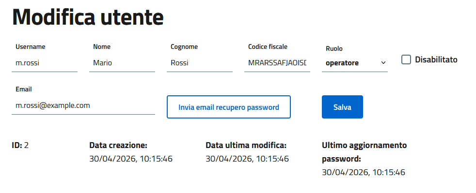
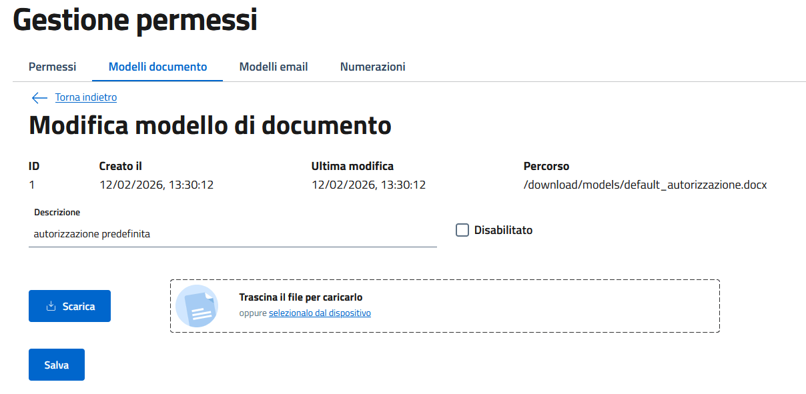
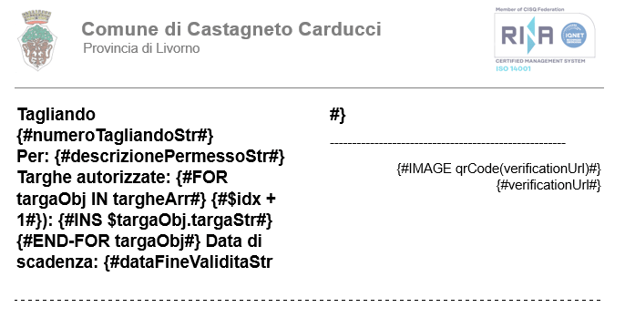
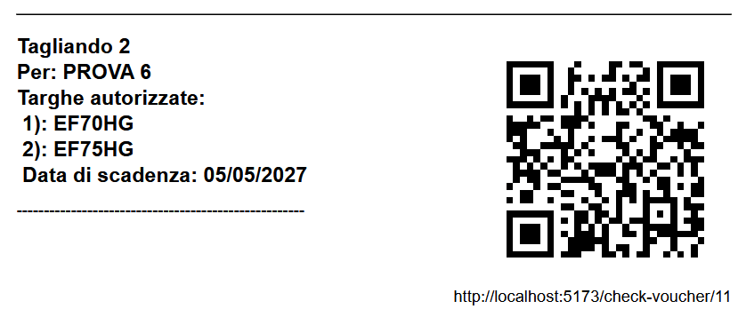
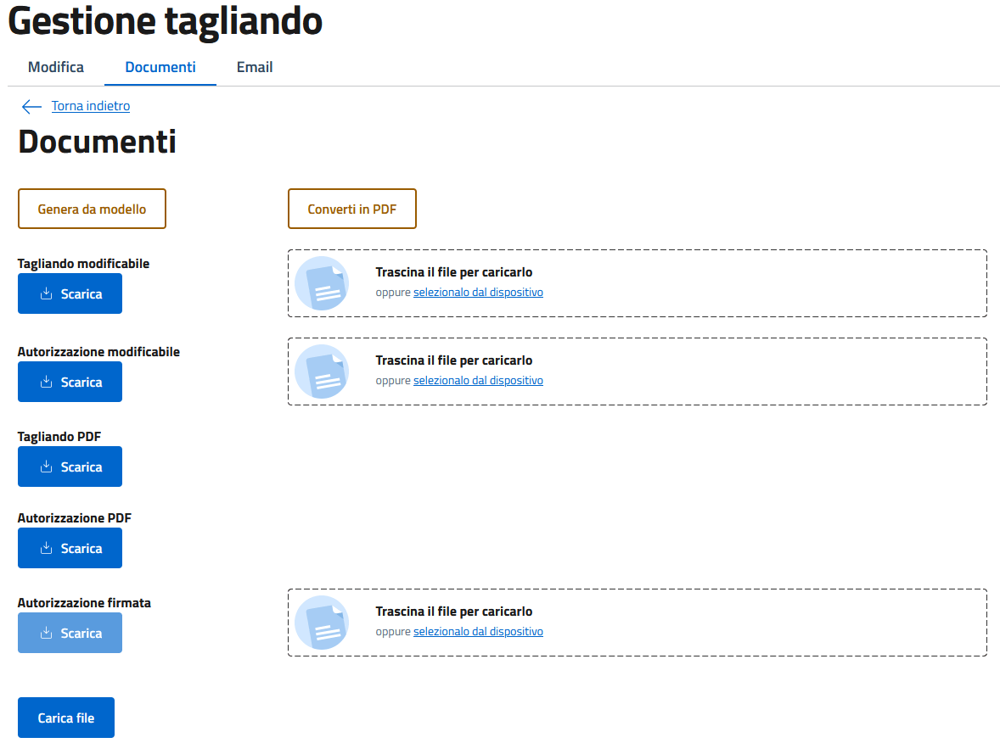
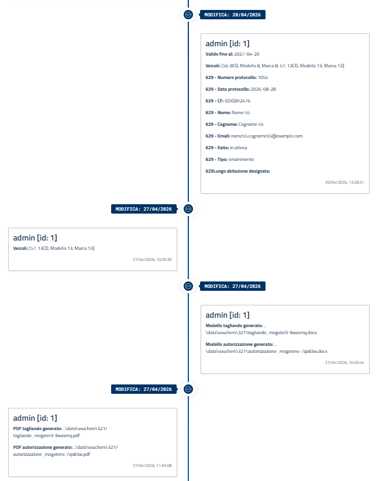

# TagliandOnline

<p align="center">
  
</p>

## Funzionalità
- Configurazione di più tipologie di permesso
- Modelli completamente personalizzabili basati su variabili
- Generazione automatica dei PDF dei tagliandi
- Modelli di email personalizzabili per ogni tipologia di permesso
- Generazione e invio di email direttamente da programma
- Storicizzazione dettagliata delle modifiche
- Numerazione automatica dei tagliandi personalizzabile
- Ispezioni sul campo per rilevare discrepanze, anche per il numero di veicoli che espone lo stesso tagliando
- PWA per smartphone
- Basato su [Design React Kit](https://github.com/italia/design-react-kit)
- Immagine Docker con variabili d'ambiente
- Multiutente con diversi ruoli
- Recupero password tramite email

## Docker setup
### Setup server
1. Installare Docker: https://docs.docker.com/engine/install/

2. Creare il seguente albero di cartelle
```
tagliandonline/
├── storage_data/
├── db_data/
├── docker-compose.yml
└── .env
```
3. Impostare i permessi per la cartella `storage_data`
```sh
sudo chown -R 1001:1001 tagliandonline/storage_data
```
### Configurazione docker compose
4. Inserire le seguenti configurazioni nel file `docker-compose.yml`
```YML
# docker-compose.yml
services:
  tagliandonline:
    # valutare la possibilità di forzare la versione ad un numero specifico, in modo da evitare problemi durante l'aggiornamento
    image: cedcastagneto/tagliandonline:latest
    env_file:
      - .env
    ports:
    # espone la porta 8080 nella macchina host: cambiare in base alle necessità
      - 8080:3000
    volumes:
      - ./storage_data:/app/data
    depends_on:
      - postgres
    restart: unless-stopped

  postgres:
    image: postgres:18-alpine
    env_file:
      - .env
    volumes:
      - ./db_data:/var/lib/postgresql
    healthcheck:
      test:
        - CMD
        - pg_isready
        - -d
        - ${DB_NAME}
        - -U
        - ${DB_USER}
      interval: 30s
      timeout: 20s
      retries: 3
    environment:
      POSTGRES_USER: ${DB_USER}
      POSTGRES_PASSWORD: ${DB_PASSWORD}
      POSTGRES_DB: ${DB_NAME}
    restart: unless-stopped
```
### Environment 
5. Compilare il file `.env`:
```properties
# Porta esposta nel container docker
PORT=3000

# DB psw. Cambiare la propria: meglio generata casualmente
DB_PASSWORD=CHANGEMECHANGEMECHANGEME
# DB user
DB_USER=postgres
# DB name
DB_NAME=tagliandonline
# DB host: se si utilizza docker compose, basta indicare il nome del servizio del database
DB_HOST=postgres
# DB port
DB_PORT=5432

# Segreto utilizzato per la gestione delle sessioni. Cambiare la propria: meglio generata casualmente
JWT_SECRET=CHANGEMECHANGEMECHANGEME

# Percorso dell'eseguibile di libreoffice (non necessario con docker)
# SOFFICE_PATH: "/usr/bin/soffice"

# Se è la prima volta che si effettua il login o se è stata dimenticata la password dell'utente "admin", inserire qui la nuova password che verrà sostituita forzatamente nel database al prossimo avvio. Per gli avvi successivi si consiglia di rimuovere questa variabile.
REPLACING_ADMIN_PASSWORD=dEfAuLtPaSsWoRdFoRaDmiNuSeR

# URL pubblico dal quale è possibile raggiungere l'applicativo. Facoltativamente si può specificare la porta (:8080)
BASE_URL=https://yourdomain.example.com

# Percorso in cui memorizzare file, modelli, allegati (non necessario con docker)
# DATA_PATH: "../data"

# Informazioni di connessione SMTP. L'applicazione usa SMTP per inviare mail per recupero della password e per trasmettere i tagliandi.
SMTP_HOST=smtp.example.com
SMTP_PORT=465
SMTP_USER=mailusername@example.com
SMTP_PASSWORD=YOURSMTPACCOUNTPASSWORD
# Abilita questa opzione per abilitare la connessione sicura al SMTP. Per maggiori informazioni: https://nodemailer.com/smtp#general-options
SMTP_SECURE=true

# Informazioni che compariranno nel footer e nell'header dell'applicazione, che riportano al vostro sito ufficiale.
PA_NAME=Comune di ________
PA_LINK=https://www.comune.______.__.it/
PA2_NAME=Regione _______
PA2_LINK=https://www.regione._______.it/
```
### Avvio docker 
6. Effettuare il pull
```sh
cd tagliandonline
sudo docker compose pull
```
7. Avviare i container
```sh
sudo docker compose up -d
```
### Inizia ad usarlo
Consulta la guida dedicata: [Geting started](docs/get_started.md)


## Documentazione
- [Utenti](docs/users.md)
- [Permessi e numerazione](docs/permits_numerations.md)
- [Modelli](docs/templates.md)
- [Veicoli](docs/vehicles.md)
- [Domande](docs/applications.md)
- [Tagliandi](docs/vouchers.md)
- [Ispezioni](docs/inspections.md)

## Contribuire
Per segnalare problematiche utilizzare le issues direttamente su GitHub
I contributi sono benvenuti. Per proporre una modifica è possibile aprire una pull request.
Se le modifiche che si intendono apportare rivoluzionano molto il funzionamento dell'applicativo è meglio prendere prima contatto direttamente con lo sviluppatore ced@comune.castagneto-carducci.li.it

Per configurare l'ambiente di sviluppo consultare [Setup per sviluppatori](docs/dev_env_setup.md)

## Screenshots

Gestione utenti \


Modelli modificabili in docx \


Modelli personalizzabili \


Esempio di tagliando \


Modifica i documenti anche per singolo tagliando \


Storico modifiche \



