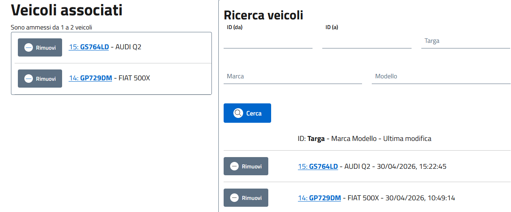
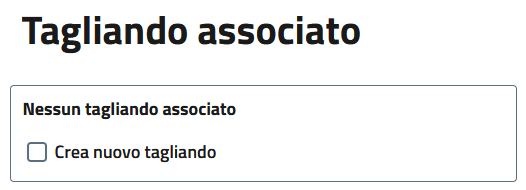
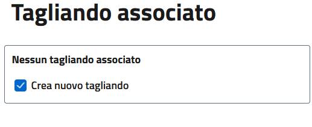
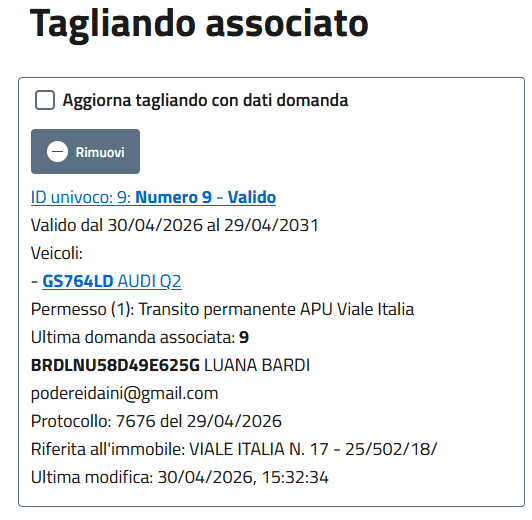
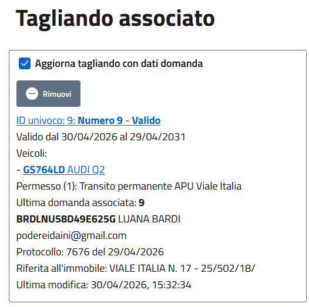

# Domande
Le domande rappresentando le richieste dei cittadini: potrebbero essere rifiutate, associate ad un tagliando esistente oppure portare alla creazione di un nuovo tagliando.

## Creazione
Si va su Domande > Nuovo. \

Quindi si compilano almeno i campi obbligatori.
Di seguito il significato di ciascun campo:
- Data richiesta: data in cui la richiesta è pervenuta all'ufficio, di solito coincide con la data del protocollo
- Numero protocollo e Data protocollo: numero e data protocllo della richiesta
- Data esito: data dalla quale far valere l'esito di questa domanda (se è accettata e si crea un tagliando rappresenta la data di inizio di validità del tagliando)
- Codice fiscale, Nome, Cognome, Data di nascita, Luogo di nascita, Comune di residenza, Indirizzo di residenza: dati del richiedente
- Email: destinatario email a cui inviare le comunicazioni
- Indirizzo immobile, Foglio, Mappale (particella), Subalterno, Categoria: Dati catastali immobile designato (in caso di permessi consentiti solo a proprietari o residenti in specifici immobili)
- Permesso associato: tipologia di permesso richiesta
- Tipo: tipo di domanda (nuovo, modifica, smarrimento, rinnovo, altro)
  > il tipo di domanda non è vincolante rispetto alle eventuali modifiche apportate al tagliando
- Esito: tipo di esito (presentata, in corso, accettata, rifiutata, in attesa, annullata) 
  > il tipo di esito non è vincolante rispetto alle eventuali modifiche apportate al tagliando

### Scelta dei veicoli
Scorrendo in basso è possibile selezionare i veicoli da associare.
In base al permesso selezionato (nello specifico al campo Targhe in domanda) scegliere dalla lista i veicoli da associare alla domanda. \
Se non ci sono vanno creati dalla tab [Veicoli](vehicles.md)

Dopo aver scelto i veicoli è necessario premere Salva

### Associazione tagliando
In base alle necessità è possibile creare o associare un tagliando. Di solito si hanno queste casistiche:
1. Domanda di nuova emissione rifiutata e pertanto non associata a nessun tagliando
  
2. Domanda di nuova emissione accettata e quindi associata a nuovo tagliando
  
3. Domanda di modifica tagliando rifiutata e quindi associata a tagliando esistente che NON viene aggiornato
  
4. Domanda di modifica tagliando accettata e quindi associata a tagliando esistente che viene aggiornato
  
> Nei casi in cui andiamo ad aggiornare il tagliando esistente, verrà: **aggiornata la data di inizio e fine validità del tagliando con la data di esito della domanda** e **rimpiazzati i veicoli nel tagliando con quelli riportati in domanda**

Dopo aver scelto l'opzione desiderata è necessario premere Salva

