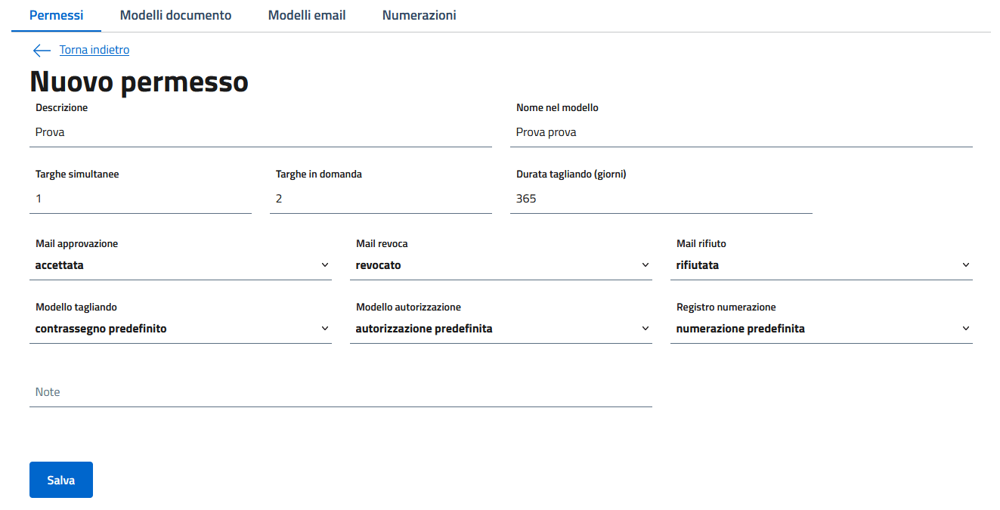

# Getting started

## 0. Setup
Configura il server e avvia TagliandOnline. Consulta la [guida docker](../README.md#docker-setup) per un setup veloce.

## 1. Primo accesso e creazione utenti
Accedere premendo in alto a destra su "Accedi all'area personale" inserendo come utente `admin` e la password riportata nella variabile `REPLACING_ADMIN_PASSWORD`.

Una vola fatto l'accesso si può già andare in Utenti e [abilitare gli utenti necessari](users.md)

## 2. Configurare numerazioni e permessi
Subito dopo è necessario creare le tipologie di permessi che vogliamo far supportare all'applicativo.

Di base TagliandOnline è distribuito con una numerazione predefinita e alcuni modelli di email e documento. Sarà necessario modificarli in base alle esigenze dell'ente. \
Di seguito le guide specifiche:
- [Modelli](templates.md)
- [Numerazioni](permits_numerations.md#numerazioni)

Per mantenere le cose semplici possiamo utilizzare i modelli predefiniti per ora. \
Si crea quindi un nuovo permessi selezionando Permessi > Permessi > Nuovo e compilando similmente a come riportato di seguito, e premere Salva

([dettagli sulla configurazione dei permessi](permits_numerations.md#permessi))

Adesso abbiamo il permesso e possiamo già iniziare ad inserire domande e tagliandi

## 3. Inizia ad usarlo
È adesso possibile iniziare ad inserire domande e tagliandi. Per farlo consultare le guide dedicate: 
- [Domande](docs/applications.md)
- [Tagliandi](docs/vouchers.md)

## 4. Ispezioni
Quando i tagliandi sono distribuiti è possibile condurre dei controlli su strada sfruttando le ispezioni. Consulta la guida dedicata: [Ispezioni](docs/inspections.md)

