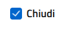
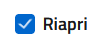
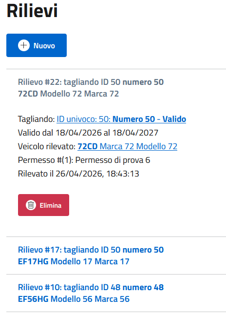
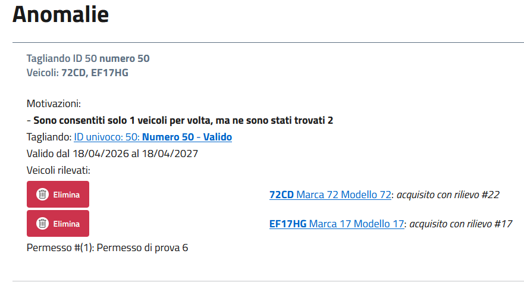

# Ispezioni
Consentono di effettuare le scansioni in serie dei tagliandi, segnando i veicoli rilevati sul posto, in modo da far emergere eventuali discrepanze o anomalie. \
L'obiettivo è quello di consentire ad un operatore esterno su strada, di controllare una serie di veicoli e scoprire se hanno: 
- tagliando decaduto, revocato, scaduto o non ancora valido (vedi [Stati tagliando](vouchers.md#controllo-tagliando))
- tagliando non associato al veicolo utilizzato
- utilizzo di più veicoli simultaneamente rispetto a quelli previsti nel permesso: se ho messo Targhe simultanee a 1 e l'utente sta usando 2 dei suoi veicoli autorizzati insieme, questo verrà rilevato

## Creazione
Per creare una nuova ispezione premere su Ispezioni > Nuovo. \
Inserire una descrizione qualsiasi e premere Salva.

## Chiusura (e riapertura)
Per riaprire o terminare un'ispezione basterà entrare nella pagina di modifica e selezionare Chiudi o Riapri, poi dare Salva. \

> È importante chiudere le sessioni concluse perché altrimenti per errore potremmo ottenere anomalie rispetto a veicoli che non sono più presenti

## Rilievi
Anche più utenti "vigili" simultaneamente possono effettuare rilievi. \
Per inserire nuovi Rilievi basta entrare su Ispezioni > Modifica (sull'ispezione designata) > In alto selezionare la tab Rilievi.

### Nuovo rilievo
Premere Nuovo per effettuare un rilievo e seguire questi passaggi: 

1. Selezione del tagliando: abbiamo più opzioni
- Ricerca tramite targa, numero, id e altro, utilizzando i filtri di ricerca
- Ricerca immediata tramite scansione del QR: basta premere Abilita scansione QR e inquadrare il QR Code sul tagliando per averlo automaticamente selezionato

2. Selezione del veicolo rilevato: selezionare il veicolo rilevato tra quelli autorizzati nel tagliando e premere Salva. **Se il veicolo non è nella lista proposta abbiamo una discrepanza**: 
- il tagliando è stato aggiornato per errore (nel caso basta cliccare il link del tagliando e visionare lo storico per capire che è successo)
- il tagliando che abbiamo selezionato è quello errato
- il veicolo effettivamente non è associato a quel tagliando e l'automobilista ha esposto il tagliando errato

### Rimozione rilievo
Se per errore è stato registrato un rilievo errato, è possibile cliccare nella tab rilievi > espandere il rilievo interessato > premere su Elimina

## Anomalie
In caso sia rilevata un anomalia durante l'aggiunta di un rilievo il sistema ci porta direttamente nella tab Anomalie con la nuova anomalia espansa. \
Qui possiamo leggere l'elenco delle Motivazioni per cui il sistema ha rilevato l'anomalia. Inoltre, in caso ci sia un errore nei rilievi, possiamo anche subito intervenire ed Eliminare i rilievi errati premendo su Elimina in corrispondenza del rilievo da togliere.

