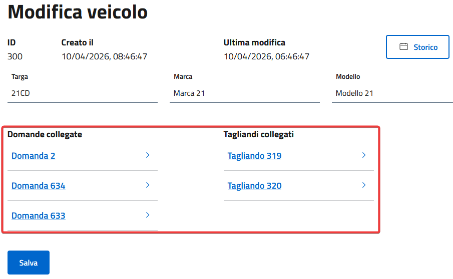

# Veicoli
I veicoli sono accomunati in una tabella del database separata, modo che sia possibile tracciare con precisione in quali tagliandi e domande sono coinvolti.

**Ogni volta, prima di creare domande o tagliandi è necessario creare i veicoli in esse coinvolti**

## Creazione
Andare su Veicoli > Nuovo \
Compilare i campi obbligatori e premere Salva

## Risalire a tagliandi e domande associati
Dalla lista dei veicoli, premendo modifica, è possibile visualizzare le domande collegate

