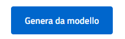
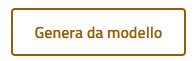
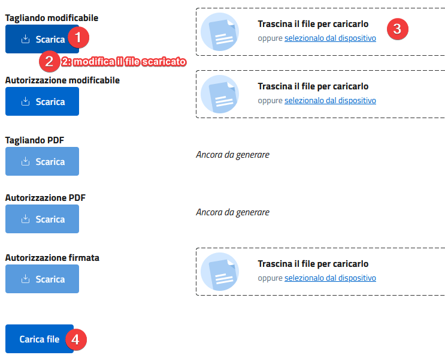
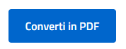
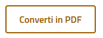
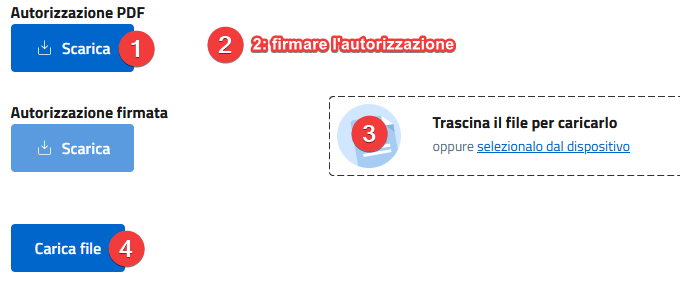
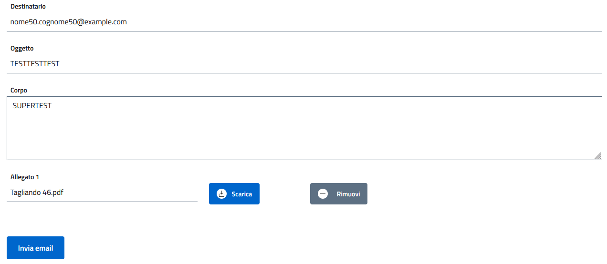

# Tagliandi
Un tagliando rappresenta autorizzazione e contrassegno concessi in un periodo di tempo a uno o più veicoli.

## Creazione
> Per prima cosa si deve aver creato almeno un [permesso](permits_numerations.md)

Per creare un tagliando ci sono più modalità:
- Creando direttamente il tagliando: premendo Tagliandi > Nuovo
- Creando il tagliando automaticamente a partire da una domanda (consigliato). \
  Entrare in modifica domanda e poi premere [crea tagliando](applications.md#associazione-tagliando) in basso

Parametri del tagliando: 
- Valido dal: data inizio validità del tagliando
- Scadenza: data di scadenza
- Permesso associato: scegliere la tipologia di permesso
- Veicoli: associare i veicoli da autorizzare
- Revocato: revoca il tagliando anche se non è scaduto

## Generazione dei documenti
Per generare i documenti entrare nella modifica del tagliando e cliccare sulla tab Documenti, quindi seguire questa procedura:

> NOTA: **è possibile ripetere la procedura quante volte si vuole, specialmente se cambiano i parametri del tagliando o i veicoli associati** \
> NOTA: **è necessario che il tagliando sia [associato almeno ad una domanda](applications.md#associazione-tagliando) affinché sia possibile generare i documenti**

1. Per generare (o rigenerare) i modelli docx a popolandoli con i dati del tagliando, cliccare su Genera da modello (se è giallo significa che sono già generati ma possiamo sempre ripetere l'operazione)

2. (facoltativo) Se necessario è possibile scaricare il modello, modificarlo con Word o similari per poi ricaricarlo (sia per tagliando che per l'autorizzazione usando i controlli corrispondenti)

3. Generare i file PDF premendo su Converti in PDF (se è giallo significa che sono già generati ma possiamo sempre ripetere l'operazione) \

> La creazione dei PDF può richiedere un po' di tempo

4. (facoltativo) Se necessario è possibile scaricare l'autorizzazione PDF, firmarla per poi ricaricarla. In questo modo verrà allegata automaticamente alla mail di trasmissione al cittadino

## Email
Una volta generato o revocato il tagliando è possibile procedere alla trasmissione della mail al cittadino.
> NOTA: **è necessario che il tagliando sia [associato almeno ad una domanda](applications.md#associazione-tagliando) affinché sia possibile generare le email**

Per generare ed inviare la mail entrare nella modifica del tagliando e cliccare sulla tab Email, quindi seguire questa procedura:
1. Per generare (o rigenerare) il modello email popolandolo con i dati del tagliando, cliccare su Genera da modello (se è giallo significa che è già generato ma possiamo sempre ripetere l'operazione)

2. (facoltativo) Modificare destinatario, oggetto e corpo. È possibile anche rinominare l'allegato (ma non sostituirlo), oppure rimuoverlo \

3. Premere Invia email: una volta inviata rimane nello storico. La mail viene inviata con il SMTP configurato nelle [variabili d'ambiente](../README.md#environment)
  > NOTA: anche se la mail viene inviata non è garantito che arrivi al destinatario. Si raccomanda di configurare un inoltro automatico per le mail ricevute sull'account usato per l'invio, così da riuscire a leggere gli errori.

## Controllo tagliando
Inquadrando il QR Code o visitando il sito `<BASE_URI>/check-voucher/<ID univoco>` \
In questo modo abbiamo sempre l'ultima versione aggiornata di quel tagliando. Tra le informazioni disponibili abbiamo anche lo stato di validità del tagliando:
- Revocato
- Scaduto
- Valido
- Non ancora valido (se la data di inizio validità non è ancora stata raggiunta)
- Decaduto (se il permesso associato è disabilitato)

